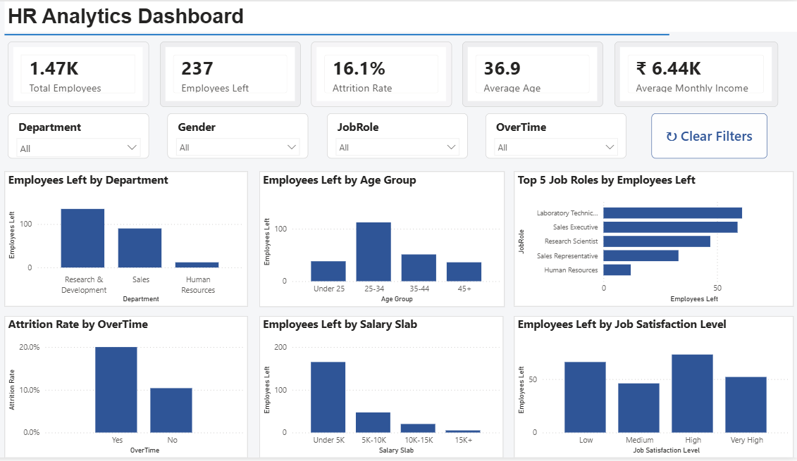

# HR Analytics Dashboard — Power BI

An interactive HR Analytics dashboard built using Microsoft Power BI and DAX to analyze employee attrition, workforce characteristics, and factors associated with employee turnover.

## 📊 Dashboard Preview

## 🎯 Project Objective

The objective of this project is to analyze employee data and create an interactive dashboard that helps identify patterns in employee attrition.

The dashboard provides insights into:

- Employee attrition
- Department-wise employee exits
- Age-group patterns
- Job-role-wise employee exits
- Overtime and attrition
- Salary slab distribution
- Job satisfaction and employee exits

## 📌 Key Performance Indicators

The dashboard includes the following KPIs:

- **Total Employees**
- **Employees Left**
- **Attrition Rate**
- **Average Age**
- **Average Monthly Income**

## 📈 Dashboard Features

- Interactive Department filter
- Interactive Gender filter
- Interactive Job Role filter
- Interactive OverTime filter
- Clear Filters button
- KPI cards
- Interactive charts
- Age-group analysis
- Salary-slab analysis
- Job satisfaction analysis
- Job-role analysis
- Attrition-rate analysis

## 📊 Visualizations

The dashboard contains six main visualizations:

1. Employees Left by Department
2. Employees Left by Age Group
3. Top 5 Job Roles by Employees Left
4. Attrition Rate by OverTime
5. Employees Left by Salary Slab
6. Employees Left by Job Satisfaction Level

## 🛠️ Tools & Technologies

- Microsoft Power BI
- DAX
- Data Analysis
- Data Visualization
- Dashboard Design
- KPI Development
- Interactive Filtering

## 🧮 DAX Measures

The project uses DAX measures for key calculations such as:

- Total Employees
- Employees Left
- Attrition Rate
- Average Age
- Average Monthly Income

## 📁 Project Files

| File | Description |
|---|---|
| `HR_Analytics_Dashboard.pbix` | Power BI dashboard file |
| `screenshots/dashboard.png` | Preview of the completed dashboard |

## 💡 Key Insights

The dashboard can be used to explore employee attrition patterns across different departments, age groups, job roles, overtime status, salary levels, and job satisfaction levels.

The interactive filters allow users to investigate these patterns from different perspectives.

## 👨‍💻 Project Purpose

This project was created as a practical data analytics and Power BI portfolio project to demonstrate skills in data analysis, DAX, KPI development, visualization, and dashboard design.

---

**Tools:** Power BI | DAX | Data Analytics | Data Visualization
